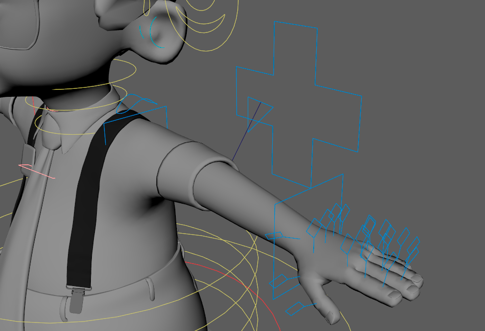
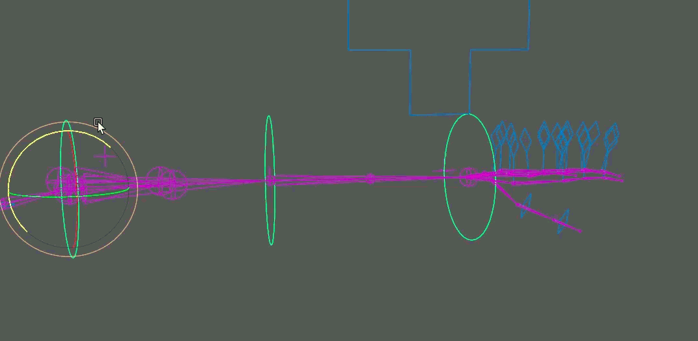
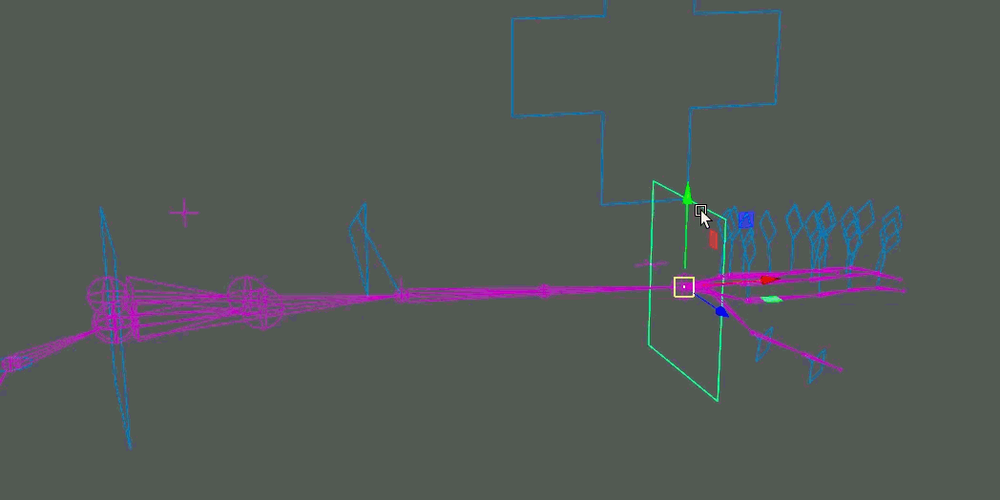
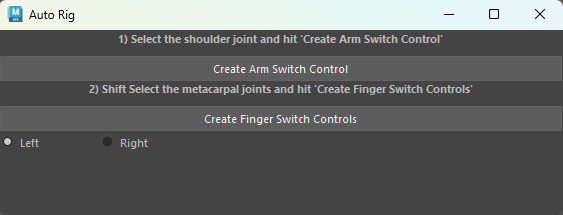

# Maya Arm Auto Rigger

A Python auto-rigging tool for Autodesk Maya that generates an IK/FK arm and hand rig from an existing joint chain.

This tool was developed to explore procedural rig construction and automate repetitive parts of the character rigging process. It creates the supporting joint systems, animation controls, IK/FK switching, and twist setup needed for a functional arm rig.

## Demo


## Features

* Automatic IK and FK arm setup
* IK/FK switching
* FK arm controls
* IK wrist and elbow pole-vector controls
* IK/FK finger controls
* Individual IK/FK switching for fingers
* Clavicle control
* Shoulder and wrist roll/twist setup
* Automatic control and joint hierarchy organization
* Left and right arm support
* Color-coded controls
* Maya UI for running the rigging process

## Rig Overview



The tool generates separate IK, FK, and target joint systems from the supplied bind skeleton. The target skeleton blends between the IK and FK systems and drives the original bind skeleton.

Generated rig elements are automatically organized into control and joint groups to keep the resulting Maya scene manageable.

## IK/FK System

The arm can be switched between IK and FK using a dedicated switch control.

### FK

The FK setup generates controls for the arm joint chain, allowing traditional hierarchical rotation of the shoulder, elbow, and wrist.



### IK

The IK setup includes:

* Wrist IK control
* Elbow pole-vector control
* Shoulder IK control
* Visual connection between the elbow and pole-vector control



## Finger Controls

The tool can also generate IK and FK systems for the fingers.

Each finger receives its own IK/FK switch, allowing individual fingers to operate independently in either mode.


## Twist / Roll Joints

The rig includes additional shoulder and wrist roll joints designed to distribute rotation along the arm rather than concentrating all twisting deformation at a single joint.


## Usage

### Requirements

* Autodesk Maya
* Python
* Maya `cmds`

### Running the Tool

1. Download `arm_auto_rigger.py`.
2. Open Maya.
3. Open the **Script Editor**.
4. Load and execute the script.

The **Auto Rig** window will appear.



### Creating the Arm Rig

1. Select the shoulder joint of the bind skeleton.
2. Choose **Left** or **Right** in the Auto Rig window.
3. Click **Create Arm Switch Control**.

The tool will generate the IK/FK arm systems, controls, switch control, clavicle control, and supporting rig hierarchy.

### Creating Finger Controls

After creating the arm rig:

1. Shift-select the metacarpal joints for the fingers.
2. Click **Create Finger Switch Controls**.

The tool will generate the corresponding IK and FK finger systems and connect their switches to the arm switch control.

## Joint Naming

The auto rigger expects the input skeleton to follow the naming conventions used by the tool.

Examples include:

```text
BIND_shoulder_JNT_L
BIND_elbow_JNT_L
BIND_wrist_JNT_L
BIND_ribs_JNT
```

The tool uses prefixes to identify the different generated joint systems:

```text
BIND_    Original bind skeleton
IK_      IK skeleton
FK_      FK skeleton
TRG_     Target/blended skeleton
ROLL_    Roll joints
FOLLOW_  Supporting follow joints
```

Side suffixes are:

```text
_L       Left
_R       Right
```

Because the tool relies on these naming conventions to locate and generate corresponding joints and controls, the input skeleton should follow the expected structure before running the auto rigger.

## Generated Hierarchy

The tool automatically organizes generated nodes into groups similar to:

```text
GRP_arms_RIG
│
├── GRP_arm_RIG_L
│   ├── GRP_arm_CTRLS_L
│   │   ├── FK_CTRLS_L
│   │   ├── IK_CTRLS_L
│   │   └── SWITCH_CTRLS_L
│   │
│   └── GRP_arm_JNTS_L
│       ├── FK_JNTS_L
│       ├── IK_JNTS_L
│       ├── TRG_JNTS_L
│       └── FOLLOW_JNTS_L
│
└── GRP_arm_RIG_R
```

This separates animation controls from the underlying rig systems and keeps the generated setup organized.

## Technical Overview

The tool is written in Python using Maya's `cmds` module.

Some of the rigging systems created procedurally include:

* Joint hierarchy duplication and renaming
* IK handle creation
* Pole-vector constraints
* Parent and orient constraints
* IK/FK blending through constraint weights
* Reverse nodes for IK/FK visibility and weighting
* Procedural NURBS curve controls
* Control offset groups
* Roll joint systems
* Automated rig hierarchy construction

## Project Background

I originally developed this tool while studying Computer Science and Animation at Brigham Young University as part of my exploration of character rigging and technical animation.

The project combines my interests in character rigging and software development by turning a manual rigging workflow into a repeatable procedural tool.

## Future Improvements

Potential areas for continued development include:

* More flexible input skeleton naming
* Automatic skeleton validation
* Improved error handling and user feedback
* Modular rig component generation
* Additional control customization
* Installation as a Maya shelf tool or package

## Author

**Delaney Reed Sabey**

Technical Artist / Developer

[Portfolio](https://delaneyreed.com)

## License

See the `LICENSE` file for licensing information.
